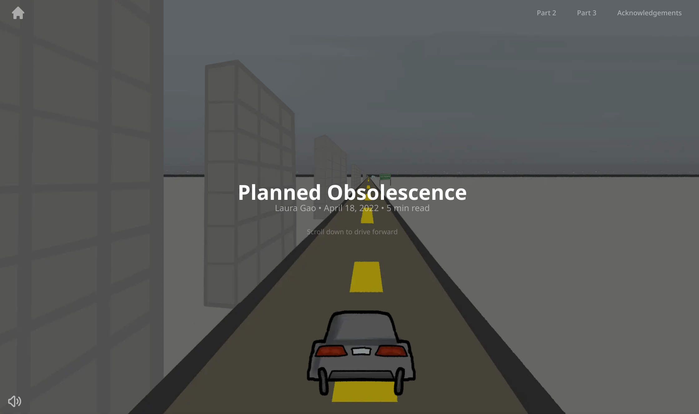

# Planned obsolescence

Check it out!! [https://planned-obsolescence.vercel.app/](https://planned-obsolescence.vercel.app/)

## Development

This website is built with Next.js (a React.js framework), typescript, tailwindcss, and p5.js.

`npm i` to install packages and then `npm run dev` to view the website locally on `http://localhost:3000`.

### Table of Contents

-   CSS: `styles/globals.css`
-   Homepage: `pages/index.tsx`
-   Page 2: `pages/page-2.tsx`
-   Page 3: `pages/page-3.tsx`
-   Works Cited: `pages/credits.tsx`
-   All image files in `images` folder
-   Music file in `public` folder
